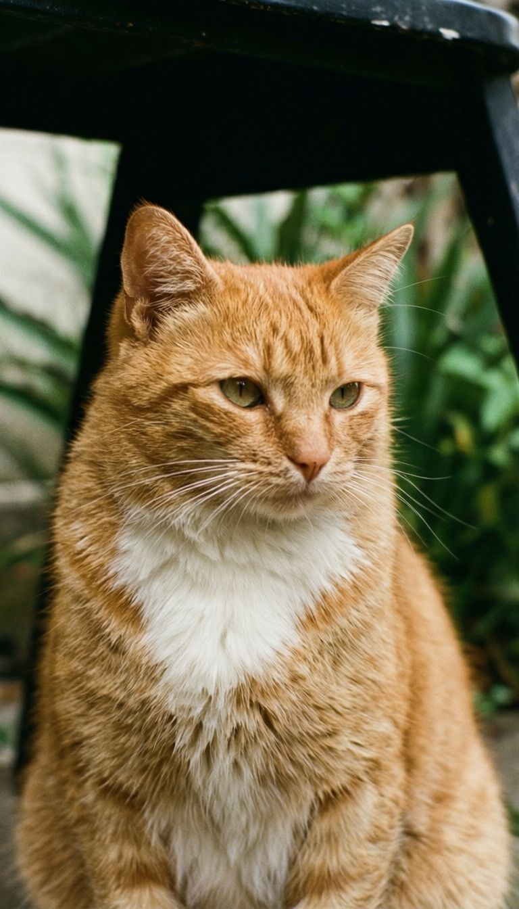
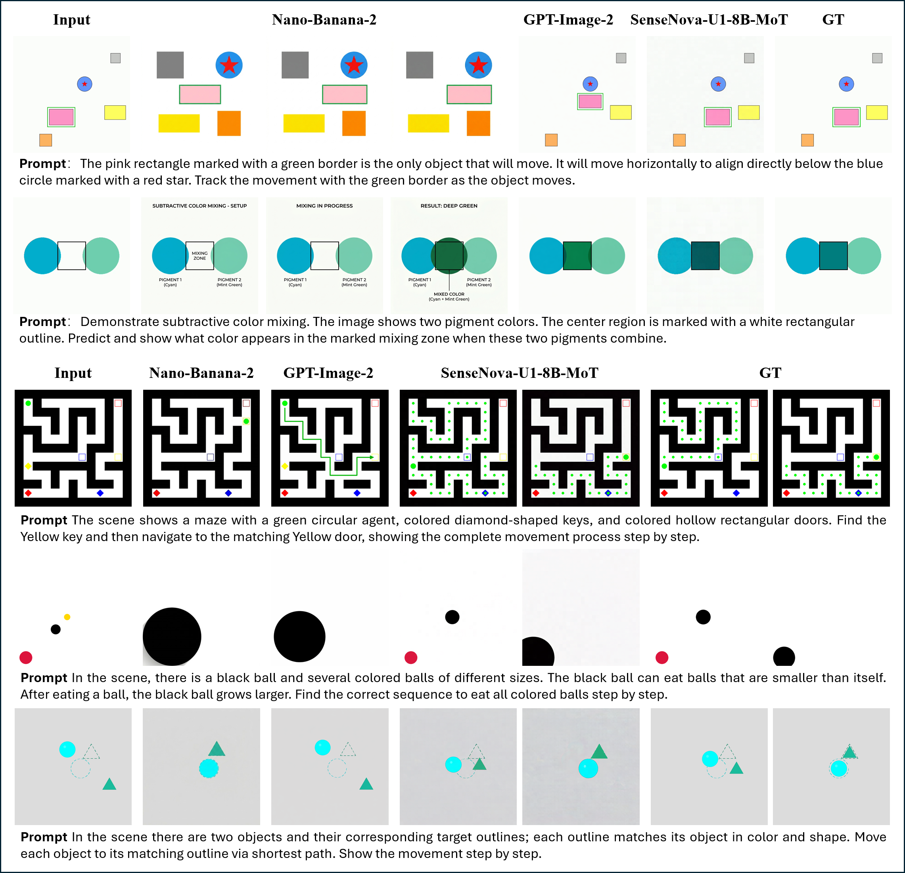
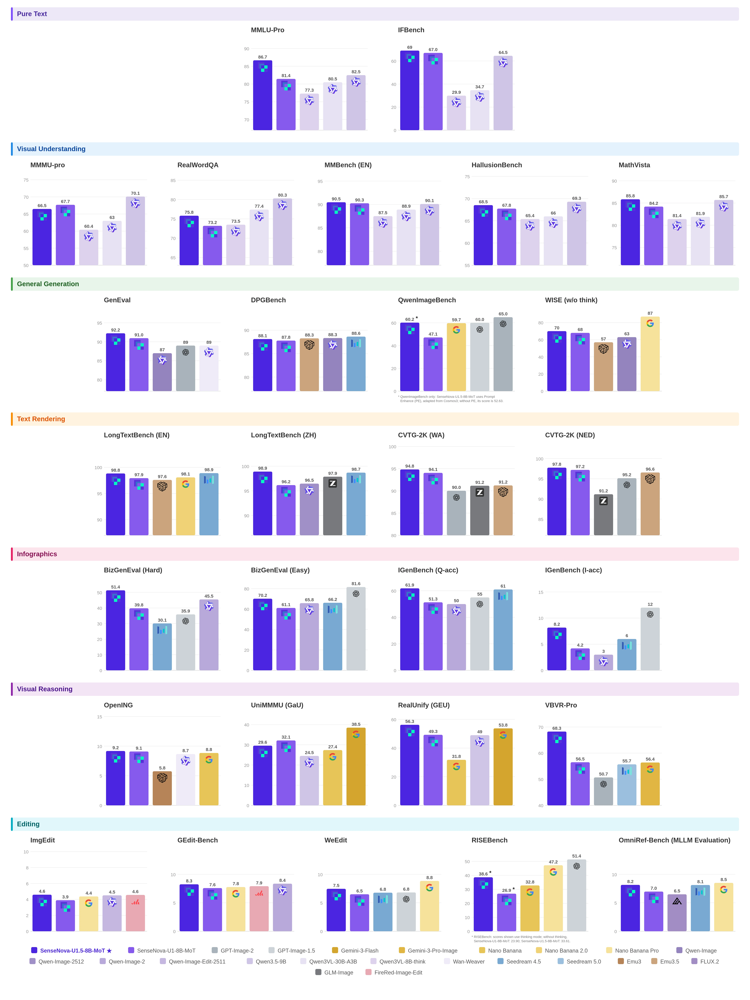

# SenseNova-U1.5-8B-MoT Forge

<p align="center">
  <a href="https://huggingface.co/sensenova/SenseNova-U1.5-8B-MoT"></a>
  
  
  
  
</p>

<p align="center">
  
</p>

Forge is a checkpoint-specific, high-performance stack for full-parameter
supervised fine-tuning, verifiable reinforcement learning, and production
inference of **SenseNova-U1.5-8B-MoT**. SFT and GDPO/UniGDPO use PyTorch 2.8
FSDP2, while text/image trajectories are served through pinned LightLLM +
LightX2V engines. The complete stack runs in one H200-only runtime.

## Highlights

| SFT | RL | Inference & rollout |
| --- | --- | --- |
| Full-parameter U1.5 training | GDPO and UniGDPO | Continuous-batch text decode |
| Native-resolution packing | Text-token and image-SDE PPO objectives | T2T, T2I, IT2I and interleaved generation |
| Block-level FSDP2 | Frozen old policy and SFT reference | Hybrid SDE–ODE rollout traces |
| Model-only DCP checkpoints | Block-level FSDP2 + DCP checkpoint | Atomic online NCCL weight updates |
| Atomic HF safetensors publication | Downstream reward-provider protocol | Policy-version admission barrier |

## Architecture

```text
                         ┌──────────────────────────────┐
 authored trajectories ─►  FSDP2 full-parameter SFT    │
                         └──────────────┬───────────────┘
                                        │ DCP + HF safetensors
                                        ▼
 ┌───────────────────────┐   rollout  ┌───────────────────────┐
 │ LightLLM + LightX2V   │◄───────────►│ PyTorch 2.8 FSDP2 RL │
 │ 2-GPU serving engine  │ trace/weights│ GDPO / UniGDPO       │
 └───────────┬───────────┘             └───────────┬───────────┘
             │                                     │ reward request
             ▼                                     ▼
 OpenAI-compatible API                   downstream reward provider
                                         (task/verifier owned by caller)
```

<p align="center">
  
</p>

The reward provider is deliberately external. Forge owns the model policy,
rollout, replay, advantage construction, optimizer, checkpoint, and serving
control plane; callers own task semantics and verification.

## Quick start

### 1. Initialize production engines

```bash
git submodule update --init --recursive \
  serving/third_party/LightLLM \
  serving/third_party/LightX2V
```

### 2. Full-parameter SFT

SFT, RL, and serving share the repository-root Torch 2.8/CUDA 12.8 lock and
the `sensenova-u15-forge:unified-v8` image. Production runs require H200.

```bash
uv sync --locked

MODEL_NAME_OR_PATH=/models/SenseNova-U1.5-8B-MoT \
VOCAB_FILE=/models/SenseNova-U1.5-8B-MoT \
TOKENIZER_PATH=/models/SenseNova-U1.5-8B-MoT \
mm_data_path=/datasets/u15/meta.json \
samples_per_epoch=1185000 \
JOB_NAME=u15-ti2t-sft \
RUN_ROOT=/runs/u15-ti2t-sft \
bash training/shell/train_u1/U1.5_8B_SFT.sh
```

The launcher saves sharded DCP model weights and sample metadata and atomically
publishes the ordinary policy weights as a complete HF directory. See
[SFT](docs/sft.md) and [checkpoint handoff](docs/checkpoints.md).

### 3. Production serving

Build the self-contained Torch 2.8/CUDA 12.8 runtime. Ordinary inference
selects `FORGE_SERVING_MODALITY=ti2t` for one replica per GPU (input vision
and text decoding, without an image-generation worker), or `ti2ti` for
two-GPU LightLLM/LightX2V replicas. Eight GPUs therefore provide eight TI2T
replicas or four TI2TI replicas. The launcher uses every visible GPU by
default and exposes consecutive HTTP ports. RDMA online weight publication
continues to use the paired TI2TI topology:

```bash
docker build -f docker/rl-engine/Dockerfile \
  --build-arg FORGE_COMMIT="$(git rev-parse HEAD)" \
  -t sensenova-u15-forge:unified-v8 .

MODEL_ROOT=/models/SenseNova-U1.5-8B-MoT \
FORGE_REQUIRE_RDMA=true \
FORGE_SERVING_MODALITY=ti2ti \
CUDA_VISIBLE_DEVICES=0,1,2,3,4,5,6,7 \
bash scripts/rl_engine/launch_server.sh
```

Run the same launcher on any number of serving nodes. Give each node the next
global `FORGE_SERVING_REPLICA_ID_OFFSET`; private LightLLM ports use only the
node-local replica index, so global replica ids do not impose a cluster-size cap.
On storage-constrained cold starts, set `FORGE_SERVING_STAGGER_SECONDS` to a
nonzero integer to delay each local replica after the previous launch while
preserving the same final GPU topology and endpoints.

The service exposes `/v1/chat/completions`, `/v1/rl/rollouts`, trace streaming,
status, and online weight-control endpoints. Ordinary inference follows the
published U1.5 task profiles; RL deliberately uses a neutral full-softmax text
policy and a separately sealed hybrid SDE–ODE image schedule. See
[serving](docs/serving.md).

### 4. GDPO / UniGDPO

Forge consumes prompt-only JSONL rows and delegates reward semantics to a
persistent NDJSON command. Seal a plan, then launch FSDP2:

```bash
sensenova-forge rl-plan rl-plan-input.json
sensenova-forge rl-run /runs/u15-rl/plan.json
```

TI2T uses the text GDPO branch. TI2TI uses the same detached trajectory
advantage for text tokens and selected image SDE actions, with independent
ratio clipping, text KL, velocity-MSE, and explicit branch weights. See
[RL](docs/rl.md).

The production RL plan uses one eight-H200 FSDP2 policy. High-image batches
temporarily park initialized rank-local AdamW state on CPU during replay and
restore the exact DTensor/Tensor closure before the optimizer step; ordinary
batches keep optimizer state on GPU.

## Runtime profiles

| Profile | Python | Torch/CUDA | Transformers | Attention |
| --- | --- | --- | --- | --- |
| SFT + RL + serving | 3.12 | 2.8.0 / 12.8 | 4.57.1 | FA2 backward + FA3-Neo forward |

The runtime and every training entry fail closed on non-H200 hardware.

## U1.5 gallery

<table>
  <tr>
    <td width="33%"></td>
    <td width="33%"></td>
    <td width="33%"></td>
  </tr>
  <tr>
    <td align="center">Text-to-image</td>
    <td align="center">Text rendering</td>
    <td align="center">High-resolution composition</td>
  </tr>
</table>

<details>
<summary><strong>Image editing example</strong></summary>
<table>
  <tr>
    <th width="50%">Input</th><th width="50%">Output</th>
  </tr>
  <tr>
    <td></td>
    <td></td>
  </tr>
</table>
</details>

<details>
<summary><strong>Interleaved visual reasoning example</strong></summary>
<p align="center"></p>
</details>

<details>
<summary><strong>SenseNova-U1.5 model capability reference</strong></summary>
<p align="center"></p>
<p align="center"></p>
</details>

## Documentation

- [Installation](docs/installation.md)
- [Full-parameter SFT](docs/sft.md)
- [GDPO / UniGDPO](docs/rl.md)
- [LightLLM + LightX2V serving](docs/serving.md)
- [Checkpoint handoff](docs/checkpoints.md)
- [Runtime identities](docs/runtime.md)
- [Troubleshooting](docs/troubleshooting.md)

## Scope

Forge intentionally does not ship task datasets, benchmark runners, evaluator
copies, verifier implementations, ComfyUI nodes, GGUF/offload paths, or serial
local-inference demos. Production generation goes through LightLLM + LightX2V.

## License

Apache License 2.0. Third-party copyrights and component licenses remain in
`NOTICE`, `training/NOTICE`, and source-file headers.
